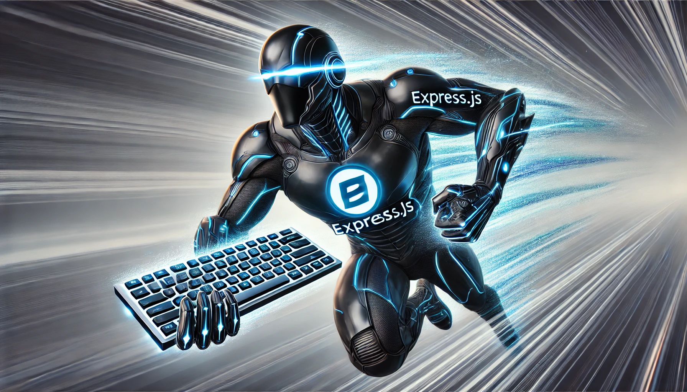

<!-- // todo  Wish list:
- //todo convert to es6
- //todo  use typescript -->

<!-- // optimize tested: 5 times -->



Below is a basic starter Express app with an MVC-like file structure and using Mongoose for MongoDB integration.

### Step 1: Initialize the Project

First, create a new directory for your project and initialize it:

```bash
mkdir my-express-app
cd my-express-app
npm init -y
git init
```

### Step 2: Install Dependencies

Install the required dependencies:

```bash
npm install express mongoose body-parser dotenv jest
```

For development and testing:

```bash
npm install --save-dev nodemon
```

### Step 3: Set Up File Structure

Create the following directories and files:

```
my-express-app/
│
├── models/
│   └── User.js
│
├── controllers/
│   └── userController.js
│
├── routes/
│   └── userRoutes.js
│
├── test/
│   └── user.test.js
│
├── config/
│   └── db.js
│
├── app.js
├── package.json
└── README.md
```

_commands_

```bash
mkdir -p models controllers routes test config
touch models/User.js controllers/userController.js routes/userRoutes.js test/user.test.js config/db.js config/config.env app.js .gitignore
```

Add node modules and sensitive env variables

```gitignore
# Node modules
node_modules/

# Environment variables
config/config.env
```

Add config/config.env environment variables file

```env
NODE_ENV=development
PORT=4000

MONGO_URI=<your mongo uri from mongoDb>
```

### Step 4: Configure the Application

#### `app.js`

Set up the Express application:

```javascript
const express = require("express");
const bodyParser = require("body-parser");
const connectDB = require("./config/db");
const dotenv = require("dotenv");

// Load env vars
dotenv.config({ path: "./config/config.env" });

const app = express();

// Connect to the database
connectDB();

// Middleware
app.use(bodyParser.json());

// Routes
app.use("/api", require("./routes/userRoutes"));

// Start the server
const port = process.env.PORT || 4000;
app.listen(port, () => console.log(`Server running on PORT: ${port}`));

module.exports = app;
```

#### `config/db.js`

Set up the MongoDB connection:

```javascript
const mongoose = require("mongoose");

const connectDb = async () => {
  try {
    await mongoose.connect(process.env.MONGO_URI, {
      useNewUrlParser: true, // this is the url parser with added functionality to parse complex url's with multiple hosts/addresses
      useUnifiedTopology: true, // this adds in better server handling to meet distributed needs
    });
    console.log("hello, we have connection to the database");
  } catch (error) {
    console.error(err.message);
    process.exit(1); // this ensures we dont run an app in spite of a failed connection
  }
};

const disconnectDb = async () => {
  await mongoose.disconnect();
}; //todo need more info on why besides to get test working

module.exports = { connectDb, disconnectDb };
```

#### `routes/userRoutes.js`

Create routes for the User operations:

```javascript
const express = require("express");
const router = express.Router();
const userController = require("../controllers/userController");

router.post("/users", userController.createUser);
router.get("/users", userController.getUsers);

module.exports = router;
```

#### `controllers/userController.js`

Create a controller for User operations:

```javascript
const User = require("../models/user");

exports.createUser = async (req, res) => {
  const { name, email, password } = req.body;

  try {
    let user = new User({ name, email, password });
    await user.save();
    res.status(201).json(user);
  } catch (err) {
    res.status(500).json({ error: err.message });
  }
};

exports.getUsers = async (req, res) => {
  try {
    const users = await User.find();
    res.status(200).json(users);
  } catch (err) {
    res.status(500).json({ error: err.message });
  }
};
```

Create a simple User schema:

```javascript
const mongoose = require("mongoose");

const User = new mongoose.Schema({
  name: {
    type: String,
    required: true,
  },
  email: {
    type: String,
    required: true,
    unique: true,
  },
  password: {
    type: String,
    required: true,
  },
});

module.exports = mongoose.model("User", User);
```

### Step 5: Run the Application

Add a start script to `package.json`:

```json
"scripts": {
  "start": "node app.js",
  "dev": "nodemon app.js"
}
```

Start the application:

```bash
npm run dev
```

### Step 6: Test the Application

#### `test/user.test.js`

Update the test file to use Jest and Supertest:

```javascript
const request = require("supertest");
const app = require("../app");
const mongoose = require("mongoose");
const { connectDb, disconnectDb } = require("../config/db");

beforeAll(async () => {
  await connectDb();
});

afterAll(async () => {
  await disconnectDb();
  await mongoose.connection.close();
});

describe("Users", () => {
  describe("GET /api/users", () => {
    it("should get all users", async () => {
      const response = await request(app).get("/api/users");
      expect(response.status).toBe(200);
      expect(Array.isArray(response.body)).toBe(true);
    });
  });

  describe("POST /api/users", () => {
    it("should create a new user", async () => {
      const user = {
        name: "John Doe",
        email: "john@example.com",
        password: "123456",
      };
      const response = await request(app).post("/api/users").send(user);
      expect(response.status).toBe(201);
      expect(response.body).toHaveProperty("name", "John Doe");
    });
  });
});
```

#### Running Tests

Add a test script to `package.json`:

```json
"scripts": {
  "test": "jest"
}
```

Run the tests:

```bash
npm test
```

With this setup, you have a basic Express app with an MVC-like structure, using Mongoose for MongoDB integration, and a testing setup using Jest and Supertest.
